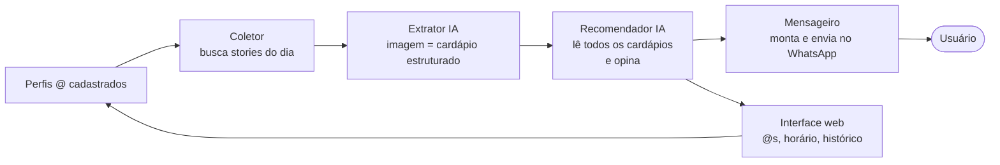

# Yaris-Iguinho

Automação para escolher onde almoçar.

Todo dia útil, no horário que eu escolher, recebo no WhatsApp os cardápios do dia
dos restaurantes que sigo no Instagram, junto com uma sugestão de onde almoçar —
a opinião da IA depois de ler todos os cardápios.

---

## Índice

- [O problema](#o-problema)
- [Como funciona (visão macro)](#como-funciona-visão-macro)
- [Escopo da v1](#escopo-da-v1)
- [User stories da v1](#user-stories-da-v1)
- [Backlog pós-v1](#backlog-pós-v1)
- [Sugestões de tecnologia](#sugestões-de-tecnologia)
- [Riscos e pontos em aberto](#riscos-e-pontos-em-aberto)
- [Repositório e arquitetura](#repositório-e-arquitetura)
- [Estrutura do projeto](#estrutura-do-projeto)
- [Glossário do domínio](#glossário-do-domínio)

---

## O problema

Restaurantes de comida caseira e self-service não publicam o cardápio do dia em
nenhum lugar estruturado. Publicam **um story no Instagram** — geralmente a foto
de um quadro branco ou uma arte com o prato do dia — que **some em 24h**.

Consequência: todo dia, na hora do almoço, o mesmo ritual — abrir o Instagram,
percorrer os perfis, ler os stories, comparar mentalmente e decidir. Isso custa
tempo, acontece com fome (péssimo momento para decidir) e leva a sempre cair nos
mesmos dois lugares.

**O que o sistema resolve:** transforma stories efêmeros e não estruturados em
uma única mensagem no WhatsApp, com os cardápios do dia consolidados e uma
recomendação pronta.

---

## Como funciona (visão macro)



O fluxo diário em uma frase: **um agendador dispara no horário configurado,
coleta os stories, uma IA lê as imagens e extrai os pratos, uma segunda chamada de
IA lê todos os cardápios juntos e diz onde almoçar, e a mensagem chega no
WhatsApp.**

Repare que o fluxo é de **mão única**. Na v1 o sistema não recebe nada de volta —
ver [Está fora](#está-fora-explicitamente).

---

## Escopo da v1

A v1 é deliberadamente a **menor coisa que funciona de ponta a ponta**. O
critério de sucesso é: *"por uma semana inteira, recebi a mensagem no WhatsApp
todo dia e ela foi útil"*.

### Está dentro

| # | Capacidade | Forma mais simples que funciona |
|---|---|---|
| 1 | Cadastro de perfis | CRUD de `@` do Instagram numa tela web. **Máximo 4 na v1** |
| 2 | Coleta de stories | Uma execução por dia útil, todos os perfis ativos |
| 3 | Extração do cardápio | IA multimodal lê a imagem e devolve JSON |
| 4 | Recomendação | Uma chamada de IA lê todos os cardápios do dia e opina |
| 5 | Envio no WhatsApp | Duas mensagens: imagem com os cardápios + sugestão do dia |
| 6 | Configuração de horário | Um campo de horário na tela web |
| 7 | Histórico | Sugestões dos últimos 30 dias, só na interface |

**Parâmetros definidos pelo usuário:** **exatamente 4 restaurantes na v1** (10 é o
horizonte pós-v1); **dias úteis apenas**; perfil que não postou cardápio aparece
como tile de "Cardápio indisponível" na imagem; **orçamento zero**; sem número de
WhatsApp novo; histórico retido por **30 dias**. Todos já acomodados nas decisões —
ver [Respostas já definidas](#respostas-já-definidas).

### Está fora (explicitamente)

- **Feedback e aprendizado.** A v1 não pergunta se você gostou, não recebe
  resposta e não aprende nada. A sugestão de amanhã não sabe o que aconteceu
  hoje. É o próximo item do backlog, e a decisão está registrada no
  [ADR 0002](docs/decisions/0002-v1-sem-feedback-recomendacao-por-ia.md)
- Score, heurística de repetição, ranking — a escolha é da IA, sem cálculo nosso
- Multiusuário, login, times, permissões — **um usuário só, o dono do repo**
- App mobile nativo
- Distância, geolocalização, tempo de deslocamento
- Preço, filtros de dieta, restrições alimentares, calorias
- Integração com iFood, Google Maps ou qualquer fonte além do Instagram
- Mais de uma sugestão por dia, ou sugestão de jantar
- Notificações fora do WhatsApp (e-mail, push, Telegram)

> **Consequência técnica de não ter feedback:** o sistema só **envia** mensagens,
> nunca recebe. Não há webhook, não há URL pública, não há interpretação de
> resposta. Isso simplifica bastante a integração e o deploy.

---

## User stories da v1

Formato: `Como <papel>, quero <ação>, para <benefício>`, seguido dos critérios de
aceite. Papéis: **Usuário** (eu) e **Sistema** (execução automática).

### Épico A — Cadastro de restaurantes

**US-01 — Cadastrar um perfil do Instagram**

> Como Usuário, quero cadastrar o `@` de um restaurante, para que os stories dele
> passem a ser monitorados.

- [ ] Informo o `@` e um apelido opcional (ex.: `@casadamarmita` = "Casa da Marmita")
- [ ] O sistema normaliza o `@` (remove `@`, espaços, URL completa, maiúsculas)
- [ ] `@` duplicado é rejeitado com mensagem clara
- [ ] O perfil já nasce **ativo**
- [ ] **Máximo de 4 perfis ativos na v1.** O quinto é recusado com o motivo
      explícito: a imagem do WhatsApp é uma grade 2×2 de quatro posições
      ([ADR 0005](docs/decisions/0005-grade-2x2-fixa-com-quatro-restaurantes.md))

**US-02 — Gerenciar a lista de perfis**

> Como Usuário, quero ver, desativar e remover perfis, para controlar quais
> restaurantes entram na análise sem perder o histórico.

- [ ] Vejo a lista com apelido, `@` e status (ativo/inativo)
- [ ] Consigo desativar um perfil: ele para de ser coletado, mas o histórico permanece
- [ ] Consigo remover um perfil de vez, com confirmação
- [ ] A **ordem dos perfis define a posição na grade 2×2** da imagem, e é estável
      entre os dias — é isso que me deixa bater o olho sempre no mesmo canto

---

### Épico B — Coleta e leitura dos cardápios

**US-03 — Coletar os stories do dia**

> Como Sistema, quero buscar os stories publicados hoje pelos perfis ativos, para
> ter a matéria-prima da análise.

- [ ] A coleta roda uma vez por **dia útil**, antes do horário de envio
- [ ] Fim de semana e feriado: não roda e não envia nada
- [ ] Só considera stories publicados **no dia corrente**
- [ ] Perfil sem story no dia não quebra a execução: é marcado como "sem cardápio"
      e vira o **tile de "Cardápio indisponível"** na imagem
- [ ] Falha na coleta de um perfil não interrompe os demais
- [ ] Cada coleta fica registrada (perfil, horário, sucesso ou erro)

**US-04 — Extrair o cardápio da imagem**

> Como Sistema, quero que a IA leia a imagem do story e devolva os pratos do dia
> estruturados, para poder comparar restaurantes entre si.

- [ ] A imagem é enviada a um modelo multimodal que retorna **JSON validado por schema**
- [ ] O retorno tem: `éCardápio` (boolean), `pratos[]`, `acompanhamentos[]`, `confiança`
- [ ] Story que **não é cardápio** (promoção, foto de cliente, meme) é descartado
- [ ] Resposta que não bate com o schema é descartada e logada — nunca chega ao usuário
- [ ] A imagem original é guardada junto com o texto extraído, para eu poder conferir

---

### Épico C — Recomendação e envio

**US-05 — Receber a opinião da IA sobre onde almoçar**

> Como Sistema, quero que a IA leia todos os cardápios do dia de uma vez e diga
> qual restaurante escolher, para entregar uma decisão pronta em vez de uma lista.

Critério definido no [ADR 0006](docs/decisions/0006-recomendar-por-destaque-relativo-do-dia.md):
**destaque relativo do dia, temperado pelos destaques recentes.**

- [ ] Todos os cardápios extraídos no dia são enviados **numa única chamada** ao modelo
- [ ] A chamada leva junto as sugestões das **últimas duas semanas**, cada uma com
      o restaurante **e o motivo** pelo qual foi escolhida
- [ ] O modelo devolve **JSON validado por schema**: o restaurante escolhido, o
      motivo em uma frase e a frase de sugestão pronta para o usuário ler
- [ ] A escolha é a opção que mais se **diferencia das outras de hoje**, levando em
      conta que um destaque já visto nas últimas semanas perdeu a novidade
- [ ] O histórico **pondera, nunca veta**: o modelo sempre escolhe alguém, mesmo
      que tudo já tenha aparecido na janela
- [ ] "Destaque" é diferenciação entre restaurantes, **não** variedade interna do
      cardápio de um deles
- [ ] O restaurante escolhido é obrigatoriamente **um dos que têm cardápio hoje** —
      resposta apontando para outro é rejeitada
- [ ] A justificativa cita algo concreto do cardápio. Quando os cardápios são
      parecidos, ela sai **honestamente fraca** em vez de inventar diferença
- [ ] Um só cardápio no dia: é ele, sem chamada desnecessária ao modelo
- [ ] Zero cardápios: mensagem honesta ("não achei cardápio hoje"), não um chute
- [ ] Resposta inválida do modelo é descartada e logada; a mensagem sai com os
      cardápios e sem sugestão, em vez de não sair

**US-06 — Receber a mensagem no WhatsApp**

> Como Usuário, quero receber os cardápios e a sugestão no WhatsApp no horário que
> escolhi, para decidir sem abrir o Instagram.

Formato definido no [ADR 0004](docs/decisions/0004-mensagem-em-dois-templates-com-imagem-composta.md):
**duas mensagens**, sem nenhuma interação.

- [ ] A entrega chega no horário configurado, **apenas em dias úteis**
- [ ] **Mensagem 1:** saudação com meu nome + **uma imagem composta** com os
      cardápios do dia, cada um com o nome do restaurante
- [ ] A imagem é uma **grade 2×2 fixa**, sempre com quatro tiles
      ([ADR 0005](docs/decisions/0005-grade-2x2-fixa-com-quatro-restaurantes.md)):

      Story 1 | Story 2
      -----------------
      Story 3 | Story 4

- [ ] Cada restaurante ocupa **sempre a mesma posição**, todos os dias
- [ ] Restaurante que não postou mantém seu tile, com fundo neutro e o texto
      **"Cardápio indisponível"** — a grade nunca tem buraco
- [ ] A imagem é legível no celular e aguenta zoom sem virar borrão
- [ ] **Mensagem 2:** a sugestão do dia em frase natural, com uma justificativa
      curta e agradável de ler
- [ ] Nenhum cardápio no dia: não manda imagem de quatro tiles vazios — só a
      mensagem 2, com uma frase honesta
- [ ] Não pede resposta nem espera interação — é uma entrega de mão única
- [ ] Não sai duplicada se a execução rodar duas vezes no mesmo dia
- [ ] Falha de envio é registrada e sinalizada na interface

---

### Épico D — Configuração e histórico

**US-07 — Configurar o horário de recebimento**

> Como Usuário, quero definir a que horas a mensagem chega, para receber quando
> for útil pra mim.

- [ ] Defino o horário na interface (ex.: `11:00`)
- [ ] A mudança vale a partir do próximo dia, sem precisar reiniciar nada
- [ ] Fuso horário fixo em `America/Sao_Paulo` na v1

**US-08 — Ver o histórico de sugestões**

> Como Usuário, quero ver as sugestões dos últimos 30 dias, para conferir se o
> sistema está acertando e saber onde já almocei.

- [ ] Lista em ordem cronológica: data, restaurante sugerido, cardápio e a justificativa da IA
- [ ] Consigo ver a imagem original do story de cada dia
- [ ] Períodos sem dados aparecem explicitamente, não somem da lista
- [ ] **Retenção de 30 dias:** passado esse prazo, sugestão e imagens são apagadas
      automaticamente. O histórico vive **só aqui** — a conversa do WhatsApp é
      descartável (posso ligar "mensagens temporárias" de 24h nela)
- [ ] O armazenamento, portanto, não cresce para sempre

---

### Ordem sugerida de implementação

A v1 fecha um ciclo completo. A ordem abaixo mantém o sistema **útil o quanto
antes** e coloca a parte de maior risco para ser validada primeiro:

1. **Furar o risco antes de construir** — provar, num script isolado, que dá para
   obter stories de um perfil de terceiro (ver [Riscos](#riscos-e-pontos-em-aberto)).
   Se isso não funcionar, nada mais importa.
2. US-01, US-02 — cadastro; nada roda sem perfis
3. US-03, US-04 — coleta e extração
4. US-06 — envio no WhatsApp, ainda com sugestão fixa ou aleatória.
   *Neste ponto o sistema já é útil todo dia.*
5. US-05 — a opinião da IA de verdade
6. US-07, US-08 — horário e histórico

---

## Backlog pós-v1

Ideias registradas para não se perderem. **Nenhuma delas entra na v1.**

| Ideia | Por que vale |
|---|---|
| **Feedback Sim/Não** | Primeiro item da fila. Fechar o ciclo: perguntar se a sugestão foi boa e gravar a resposta. Exige webhook e URL pública |
| **Lista clicável** | O desenho preferido: tocar num restaurante e receber a foto daquele cardápio. Exige o mesmo webhook do feedback — os dois devem entrar juntos |
| **Mais de 4 restaurantes** | A grade 2×2 trava a v1 em quatro. Passar disso exige decidir a estratégia de layout — só a 2×2 preserva a proporção 9:16 |
| **Aprendizado a partir do feedback** | Só faz sentido depois de acumular respostas. Pode ser peso no prompt da IA ou score próprio |
| Penalidade por repetição | Informar à IA quais restaurantes foram sugeridos nos últimos dias, para forçar rotação |
| Perfil de preferências | "Gosto de peixe, evito fígado" entrando no prompt da recomendação. ⚠️ **Bloqueado pelo free tier:** isso é dado pessoal indo para pipeline de treinamento — exige revisitar o [ADR 0003](docs/decisions/0003-gemini-free-tier-como-provedor-de-ia.md) |
| Distância e tempo a pé | Um cardápio ótimo a 25 min de caminhada não é ótimo |
| Preço do prato feito | Comparar custo, além do prato |
| Múltiplos usuários | Sugestão para o time inteiro, com votação |
| Outras fontes | Feed e posts, não só stories |
| Resumo semanal | "Essa semana você comeu frango 4x" |
| Fallback humano | Eu mandar o cardápio na mão quando a coleta falhar |

---

## Sugestões de tecnologia

> Tudo nesta seção é **sugestão**, não decisão. As escolhas definitivas serão
> registradas em [`docs/decisions/`](docs/decisions/) e resumidas na seção
> [Repositório e arquitetura](#repositório-e-arquitetura).

Premissa transversal: **TypeScript em modo `strict`**, do banco à interface.

### Base

| Camada | Sugestão | Por quê |
|---|---|---|
| Runtime | **Node.js 22 LTS** | Ecossistema maduro e suporte a TS já confortável |
| Linguagem | **TypeScript** (`strict: true`) | Requisito do projeto |
| Validação | **Zod** | Valida todas as bordas — provedor de stories, saída da IA, formulários — e gera os tipos |
| Banco | **SQLite** + **Drizzle ORM** | Um usuário e baixo volume: SQLite basta e é um arquivo só. Drizzle mantém o schema tipado e permite migrar para Postgres depois sem reescrever |
| Agendamento | **node-cron** | O caso de uso é literalmente "todo dia às 11h". BullMQ com Redis é excesso na v1 |
| Testes | **Vitest** | Rápido, TS nativo, API familiar |
| Lint e formatação | **Biome** | Uma ferramenta só, no lugar de ESLint + Prettier |
| Logs | **Pino** | Log estruturado, essencial para depurar uma execução que roda sem ninguém olhando |

### Coleta de stories do Instagram

⚠️ **Este é o ponto mais frágil do projeto.** Ver [Riscos](#riscos-e-pontos-em-aberto).

| Opção | Situação |
|---|---|
| Instagram Graph API (oficial) | **Não serve.** Só expõe stories de contas Business que *você* administra, não de perfis de terceiros |
| Provedor terceirizado (Apify, HikerAPI e similares) | Funciona hoje, mas **custa por execução — descartado pelo orçamento zero** |
| Scraping próprio com sessão logada | Sem custo recorrente e com controle total; alto risco de bloqueio da conta e manutenção constante |
| Pedir o cardápio aos restaurantes | Zero risco técnico; inviável na prática |

**Com orçamento zero, sobra o scraping próprio.** É a opção mais trabalhosa e a
mais sujeita a quebrar, então duas precauções não são opcionais:

- **Esconda tudo atrás de uma interface `StoriesProvider`** desde o primeiro dia,
  com uma implementação falsa para desenvolvimento e testes. Trocar de abordagem
  deve tocar um arquivo.
- **Use uma conta secundária do Instagram**, nunca a pessoal. Bloqueio de conta é
  resultado provável, não hipótese remota.

A boa notícia é a escala: 4 perfis, uma vez por dia útil. É um volume de
acesso baixo o bastante para não parecer robô, o que melhora bastante as chances
em relação a um coletor agressivo.

### Integração com o WhatsApp

Sem feedback na v1, a integração é **só de saída**: uma mensagem por dia,
nenhuma resposta recebida. Isso elimina o webhook, a URL pública e todo o
tratamento de mensagens de entrada.

> **Esclarecimento importante sobre o número.** A Cloud API exige um número
> dedicado para o **remetente** (o bot), não para o destinatário. Você continua
> recebendo no seu número pessoal de sempre. E a Meta fornece um **número de teste
> gratuito** ao criar o app, que envia para um punhado de destinatários
> verificados — o que pode ser exatamente o bot que você descreveu, sem custo e
> sem chip novo. **Isso precisa ser verificado antes de decidir** (limites atuais
> do número de teste e regras de template mudam com frequência).

| Opção | Prós | Contras |
|---|---|---|
| **Cloud API com o número de teste gratuito da Meta** — *escolhida* | Oficial, sem violar ToS, sem chip novo, sem custo. Você recebe no seu número atual | Limites do número de teste ainda a confirmar; toda mensagem exige template aprovado |
| `whatsapp-web.js` / `Baileys` (não oficiais) | Grátis, sem número novo, sem template. Envia da sua própria conta — você manda mensagem para si mesmo | **Violam os Termos de Uso do WhatsApp** — risco real de banimento do seu número pessoal; sessão precisa ficar de pé; quebram quando o WhatsApp Web muda |
| Ponte via Telegram | Grátis, trivial, zero risco de banimento | Não é WhatsApp: muda o requisito |

#### O formato da mensagem, e as duas regras que o determinaram

Template tem duas limitações duras, ambas confirmadas:

1. **Parâmetro de template não aceita quebra de linha, tab nem mais de 4 espaços
   seguidos** (teto de 1024 caracteres). Lista formatada não cabe numa variável.
2. **Lista clicável e botão com texto dinâmico só existem dentro de uma janela de
   24h aberta pelo usuário.** Não há mensagem interativa chegando sozinha às 11h.

A saída, decidida no
[ADR 0004](docs/decisions/0004-mensagem-em-dois-templates-com-imagem-composta.md):
**os nomes dos restaurantes vão na imagem, não no texto.** Isso libera o template
de qualquer conteúdo dinâmico complexo e faz cadastrar ou remover restaurante
**não exigir nova aprovação** da Meta.

- **Mensagem 1:** template com cabeçalho de mídia — saudação fixa + a imagem
  composta com os stories lado a lado
- **Mensagem 2:** template com uma variável de linha única — a sugestão do dia e
  quem não postou

**O que fica adiado:** a lista clicável, onde tocar num restaurante traz a foto
daquele cardápio. É o melhor formato, mas exige webhook. Quando ele voltar, o
**feedback vem junto** — os dois dividem a mesma infraestrutura, e era o custo do
webhook que tinha tirado o feedback da v1.

### Extração do cardápio (IA)

- **Modelo: free tier do Gemini, linha Flash** — ver
  [ADR 0003](docs/decisions/0003-gemini-free-tier-como-provedor-de-ia.md).
  Multimodal, gratuito e com folga de sobra para o nosso volume.
- **Por que não OCR puro (Tesseract):** story de cardápio é quadro branco com
  letra manuscrita, arte com fonte decorativa, texto sobre foto. OCR devolve
  string suja; um modelo multimodal devolve **estrutura semântica** — separa prato
  principal de acompanhamento e reconhece o story que é promoção, não cardápio.
- **Saída estruturada:** schema Zod convertido em JSON Schema, resposta validada
  antes de entrar no banco. Resposta inválida é descartada, nunca "mais ou menos
  aceita".
- **Cache** por identificador de story: reprocessar a mesma imagem pode dar
  resultado diferente. Com o free tier isso deixa de ser questão de dinheiro e
  passa a ser de consistência.

#### Por que o free tier resolve, e o que ele cobra

O sistema faz **cerca de 11 chamadas por dia útil** — dez imagens de story e uma
de recomendação. Os limites reportados para a linha Flash no free tier são de
~15 requisições por minuto e **~1.500 por dia**: folga de mais de cem vezes sobre
o uso real. Testar prompt e reprocessar não pesam.

O custo não é dinheiro, é privacidade. Pelos
[termos da API](https://ai.google.dev/gemini-api/terms), no tier **gratuito** o
Google usa o conteúdo enviado para desenvolver seus produtos, e revisores humanos
podem ler entradas e saídas. No tier pago, não.

Aqui isso é aceitável, porque o que enviamos já é público: fotos de stories de
restaurantes e texto de cardápio. Mas gera uma regra firme:

> **Nada de pessoal vai no prompt.** Só imagem de story público, texto de cardápio
> e nome de estabelecimento. Telefone, seu nome e preferências pessoais estão
> proibidos enquanto o free tier for o provedor.

Isso tem uma consequência no backlog: o item **"perfil de preferências"** ("gosto
de peixe, evito fígado") passa a ser dado pessoal indo para um pipeline de
treinamento. Ele exige revisitar a decisão antes de existir.

**Plano B:** modelo multimodal local via Ollama. Gratuito e sem questão de
privacidade, mas lê sensivelmente pior foto de quadro branco com letra manuscrita —
e essa leitura *é* o produto. Fica de reserva caso o free tier mude.

### Recomendação (IA)

Na v1 **não existe algoritmo de score**. A escolha é uma segunda chamada de IA,
separada da extração:

| | Extração (US-04) | Recomendação (US-05) |
|---|---|---|
| Entrada | Uma imagem | Cardápios do dia em texto + sugestões das últimas 2 semanas |
| Chamadas | Uma por story | **Uma por dia** |
| Saída | `DailyMenu` estruturado | Restaurante escolhido + motivo + frase pronta |

Por que separar em duas chamadas em vez de mandar todas as imagens de uma vez:

- **Cacheável.** Story já lido não é reprocessado; a recomendação é sempre nova
- **Depurável.** Dá para saber se o erro foi na leitura da imagem ou no julgamento
- **Barata.** A segunda chamada recebe texto curto, não imagens

Pontos de atenção do prompt de recomendação:

- A saída é **JSON validado por schema**, como qualquer outra saída de IA
- O restaurante escolhido precisa ser **verificado contra a lista** de quem tem
  cardápio hoje — modelo pode inventar nome ou escolher um restaurante que não
  postou
- A justificativa precisa citar algo concreto do cardápio; peça isso no prompt
- A frase de sugestão sai pronta do modelo, em português do Brasil, no tom de
  conversa — é ela que o usuário lê no WhatsApp
- **O critério é destaque relativo, temperado pelos destaques recentes**
  ([ADR 0006](docs/decisions/0006-recomendar-por-destaque-relativo-do-dia.md)). O
  histórico entra com **o motivo de cada escolha, não só o nome** — o que cansa é
  comer lasanha de novo, não ir ao mesmo endereço
- **Nada de fórmula.** A ponderação do histórico é julgamento do modelo. Penalidade
  em dias ou peso por recência foi recusado de propósito: regra mecânica sobrepõe
  contabilidade à comida

### Interface web

| Opção | Comentário |
|---|---|
| **Next.js** (App Router) — *recomendada* | UI e API num projeto só; menos peças móveis para um sistema de um usuário |
| Vite + React, com API separada | Separação mais limpa; em troca, dois deploys e duas configurações |

Estilo: **Tailwind CSS** com **shadcn/ui**. São três telas simples, sem motivo
para desenhar componente do zero.

### Deploy

Sem webhook, o sistema precisa apenas de **execução agendada confiável** e de
**armazenamento persistente** — não de URL pública para receber chamadas. Com
orçamento zero, a opção mais coerente é inesperada:

**Rodar na sua própria máquina.** A mensagem sai às 11h de um dia útil, que é
exatamente quando o computador de trabalho está ligado e com você na frente dele.
Agendamento pelo Task Scheduler do Windows, SQLite num arquivo local, sem
hospedagem, sem custo, sem URL pública. E se a integração com o WhatsApp acabar
sendo por biblioteca não oficial, ela precisa de uma sessão de pé de qualquer
jeito — o que combina com execução local.

Alternativas, caso a máquina local não sirva:

- **Railway** ou **Fly.io** em plano gratuito: cômodo, mas as franquias mudam e
  costumam hibernar processo ocioso
- **VPS com Docker**: mais controle, mas tem custo mensal — fora do orçamento

Atenção em qualquer opção hospedada: plataforma que hiberna processo ocioso
simplesmente não dispara o agendamento. A entrega diária é o produto — se ela não
sai, não há sistema.

Segredos em variáveis de ambiente, **nunca commitados**, inclusive rodando local.

---

## Riscos e pontos em aberto

| # | Risco | Impacto | Encaminhamento |
|---|---|---|---|
| R1 | **Não existe forma oficial de obter stories de perfis de terceiros.** Com orçamento zero, sobra scraping próprio — que pode quebrar a qualquer momento e viola os termos do Instagram | **Crítico** — sem isso não há produto | Validar num spike **antes** de construir qualquer outra coisa; isolar atrás de `StoriesProvider`; usar conta secundária, nunca a pessoal |
| R2 | ~~Restrições de template impedem uma mensagem legível~~ — **resolvido** pelo formato em duas mensagens com imagem composta ([ADR 0004](docs/decisions/0004-mensagem-em-dois-templates-com-imagem-composta.md)) | — | Resta o risco derivado, R12 |
| R3 | O story de cardápio pode ser **vídeo ou carrossel**, não só imagem estática | Médio | Decidir na v1: extrair o primeiro frame ou ignorar vídeo |
| R4 | Restaurante que posta o cardápio **depois** do horário de coleta | Médio | Coletar perto do horário de envio; considerar uma segunda passada |
| R5 | A IA extrair o prato errado, ou escolher mal, e me mandar a um lugar que não tem aquilo | Médio | Sem feedback, o sistema **não tem como detectar isso sozinho** na v1. Mitigação: mostrar a imagem original e a justificativa no histórico, para eu conferir na mão |
| R6 | ~~Sem histórico, a IA repete o mesmo restaurante~~ — **tratado** pelo critério de destaque relativo com janela de duas semanas ([ADR 0006](docs/decisions/0006-recomendar-por-destaque-relativo-do-dia.md)) | — | Restam os riscos derivados, R13 e R14 |
| R7 | Scraping próprio derrubar a conta usada para coletar | Médio | Conta secundária dedicada, nunca a pessoal; volume baixo (10 perfis, 1x/dia) ajuda |
| R8 | ~~Orçamento zero incompatível com IA em nuvem~~ — **resolvido** pelo free tier do Gemini ([ADR 0003](docs/decisions/0003-gemini-free-tier-como-provedor-de-ia.md)) | — | Resta o risco derivado, R10 |
| R9 | Rodando na máquina local, um dia com o computador desligado é um dia sem mensagem | Baixo | Aceitável na v1; a interface mostra que não rodou |
| R10 | **Limites de free tier mudam sem aviso e sem garantia contratual.** Modelos já foram removidos do tier gratuito antes | Médio | Manter o modelo atrás de interface própria; Ollama local como plano B |
| R11 | No free tier, o conteúdo enviado alimenta o treinamento do Google e pode ser lido por revisores humanos | Baixo hoje | Aceitável porque o conteúdo é público. Regra: **nada de pessoal no prompt**. Bloqueia o item "perfil de preferências" do backlog |
| R12 | **A imagem composta pode ficar ilegível.** Mesmo na grade 2×2, cada tile ocupa um quarto da imagem, e o WhatsApp ainda recomprime. Ler o cardápio provavelmente exige zoom | Alto | Grade 2×2 fixa preserva o 9:16 e maximiza a área na bolha ([ADR 0005](docs/decisions/0005-grade-2x2-fixa-com-quatro-restaurantes.md)). Resta **montar com stories reais e olhar no celular** — não se resolve no papel |
| R13 | **Distinção fabricada.** O prompt pede diferenciação, e modelo cobrado por diferença tende a inventá-la quando os cardápios são parecidos | Médio | Instrução explícita para justificativa fraca; caso de teste com quatro cardápios quase idênticos |
| R14 | **Saturação da janela.** Com 4 restaurantes e 10 dias úteis, quase tudo já foi destaque — o modelo pode travar procurando novidade que não existe | Médio | Regra de que o histórico pondera mas nunca veta; caso de teste com histórico saturado |

### Respostas já definidas

| Pergunta | Resposta |
|---|---|
| Quantos restaurantes? | **4 na v1** — os mesmos usados para teste. Até 10 é horizonte pós-v1 |
| Todo dia ou só dias úteis? | **Dias úteis** |
| Perfil que não postou cardápio? | **Aparece na mensagem**, nomeado: "o restaurante X não postou cardápio até agora" |
| Provedor pago de stories? | **Não. Custo zero** — o que deixa o scraping próprio como único caminho |
| Número de WhatsApp novo? | **Não.** Cloud API com o número de teste gratuito da Meta como remetente; você recebe no seu número atual |
| Formato da mensagem? | **Duas mensagens de template**: saudação + imagem composta com os cardápios, depois a sugestão do dia ([ADR 0004](docs/decisions/0004-mensagem-em-dois-templates-com-imagem-composta.md)) |
| Histórico? | **30 dias**, só na interface. A conversa do WhatsApp é descartável |
| Qual provedor de IA, com custo zero? | **Free tier do Gemini, linha Flash.** ~11 chamadas/dia contra um teto reportado de ~1.500/dia ([ADR 0003](docs/decisions/0003-gemini-free-tier-como-provedor-de-ia.md)) |

### Perguntas em aberto

O conflito da IA foi resolvido pelo free tier do Gemini. Sobra o do WhatsApp, que
não impede começar — o spike do Instagram (R1) vem antes — mas precisa de resposta
antes de a integração ser construída.

Itens de verificação do Gemini, que não bloqueiam a decisão:

- [ ] Confirmar os limites reais no painel do Google AI Studio. A documentação
      oficial deixou de publicar a tabela, e os números usados aqui vêm de fontes
      secundárias
- [ ] Confirmar a disponibilidade do free tier no Brasil

Itens de verificação do WhatsApp, que também não bloqueiam:

- [ ] **Legibilidade da imagem composta** com stories reais, olhando no celular —
      é o item de maior risco do ADR 0004 e não se resolve no papel
- [ ] Limites do número de teste gratuito da Meta, no painel

Nenhuma pergunta de produto em aberto no momento.

---

## Repositório e arquitetura

> 🚧 **A definir.**
>
> Esta seção receberá a estrutura de diretórios do código, os módulos e seus
> contratos, o modelo de dados e as decisões de arquitetura consolidadas.
>
> Será preenchida depois que o macro do negócio estiver fechado. As decisões que
> alimentam esta seção são registradas incrementalmente em
> [`docs/decisions/`](docs/decisions/).

---

## Estrutura do projeto

```
.
├── .claude/
│   ├── agents/          # Agentes especializados, um por domínio do projeto
│   └── commands/        # Comandos de apoio ao fluxo de trabalho
├── docs/
│   └── decisions/       # Registro de decisões (ADRs), uma por arquivo
├── CLAUDE.md            # Contexto e convenções para agentes de IA
└── README.md            # Este arquivo
```

O código ainda não existe. A estrutura dele entra na seção
[Repositório e arquitetura](#repositório-e-arquitetura) quando for definida.

### Para quem clonar

**Tudo isso é do repositório, não da máquina de quem escreveu.** Quem clonar recebe
os agentes, as decisões e as convenções junto com o código — não é configuração
pessoal que ficou para trás por acidente.

- **`CLAUDE.md`** é o contexto do projeto: convenções de código, glossário do
  domínio e os parâmetros já definidos. Ferramentas de IA o carregam sozinhas;
  para uma pessoa, é a leitura obrigatória depois deste README.
- **`.claude/agents/`** são oito agentes especializados, um por domínio. Cada um
  declara o que decide, o que **não** decide e para quem devolve. Servem tanto
  para orientar uma IA quanto para deixar explícito, para uma pessoa, onde cada
  tipo de decisão pertence.
- **`.claude/commands/decisao.md`** é o comando `/decisao`, que cria um ADR já
  numerado e atualiza o índice.
- **`docs/decisions/`** é o porquê de cada escolha, com as alternativas que foram
  descartadas. Antes de propor uma mudança de rumo, vale conferir se o caminho já
  foi considerado e recusado — e por quê.

A única coisa **não** versionada é `.claude/settings.local.json`, que guarda
permissões aprovadas localmente e é legitimamente de cada máquina. Se algum dia o
projeto precisar de configuração compartilhada, ela vai em `.claude/settings.json`,
esse sim versionado.

---

## Glossário do domínio

Vocabulário único, usado em código, documentação e conversa. Nomes em português
na comunicação e identificadores em inglês no código (ver [`CLAUDE.md`](CLAUDE.md)).

| Termo | Significa |
|---|---|
| **Perfil** (`Profile`) | Uma conta do Instagram cadastrada e monitorada |
| **Story** (`Story`) | Uma publicação efêmera coletada de um Perfil |
| **Cardápio do dia** (`DailyMenu`) | O resultado estruturado de ler um Story: os pratos de um restaurante em uma data |
| **Prato** (`Dish`) | Um item do Cardápio do dia |
| **Sugestão** (`Suggestion`) | A escolha da IA para uma data: um Cardápio do dia, a justificativa e a frase enviada ao usuário |
| **Coleta** (`Collection`) | Uma execução da busca de stories, com o resultado por perfil |
| **Horário de envio** (`DeliveryTime`) | A hora configurada para a mensagem diária |
